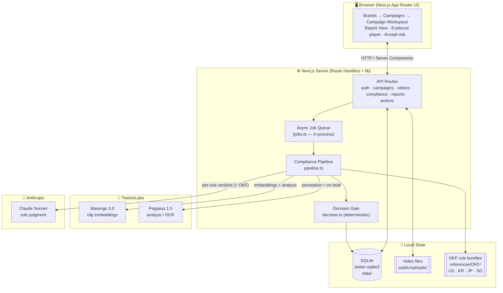
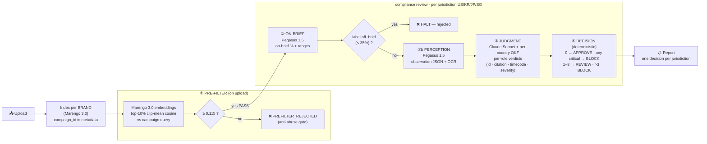

# BrandSafe — System Architecture

Agentic ad-compliance review for creator beauty-ad videos.
Next.js demo. Multimodal AI pipeline → per-jurisdiction compliance verdicts.

---

## 1. High-level architecture (Mermaid)

---

## 2. The compliance pipeline (the product)

**Re-run = judgment-only:** reuses stored Pegasus outputs, re-runs only ③ + ④ (no perception re-run).

---

## 3. Layered component view

| Layer | Components | Responsibility |
|-------|-----------|----------------|
| **UI** (`src/app/(app)`, `src/components`) | Brands → Campaigns → Campaign Workspace → Reports → Report View · `JurisdictionPicker` · `SegmentLoopDialog` · evidence cards · `VideoThumbnail` | Navigation, upload, in-list player, evidence playback, accept-risk, promote/drop/revision |
| **API** (`src/app/api`) | `auth` · `campaigns/[id]` (PATCH brief) · `campaigns/[id]/videos` (upload/list) · `videos/[id]` · `compliance` · `reports/[id]/accept` · `actions` | Request handling, enqueue jobs, read/write state |
| **Orchestration** (`src/lib`) | `pipeline.ts` (`runCompliance` / `runComplianceJudgmentOnly`) · `jobs.ts` (async queue) | Sequences pre-filter → on-brief → perception → judgment → decision |
| **AI integration** (`src/lib`) | `twelvelabs.ts` (Marengo embed + Pegasus analyze) · `anthropic.ts` (Sonnet judge + suppression filter) · `relevance.ts` (prefilter top-10% + on-brief label) | External model calls, prompt construction, output normalization |
| **Domain logic** (`src/lib`) | `decision.ts` (the deterministic gate) · `okf.ts` (national rule bundles) · `config.ts` (models/thresholds/suppression) | Verdict counting, severity floor, per-jurisdiction APPROVE/REVIEW/BLOCK |
| **Persistence** (`src/lib`, `data/`) | `db.ts` (SQLite + seed + migrations + `normalizeResults`) · `public/uploads/` · `references/OKF/` | State, video files, rule bundles |

---

## 4. Key external services & models

| Service | Model | Role |
|---------|-------|------|
| **TwelveLabs** | Marengo 3.0 | Clip embeddings → pre-filter relevance gate (no Pegasus on index) |
| **TwelveLabs** | Pegasus 1.5 (analyze by `asset_id`) | On-brief % + perception JSON with **real OCR** of on-screen text |
| **Anthropic** | Claude Sonnet | Per-rule compliance judgment against per-country OKF bundle |

**Decision gate (per jurisdiction, deterministic):** `0 → APPROVE` · `any critical → BLOCK` · `1–3 → REVIEW` · `>3 → BLOCK`. Accepted-risk violations excluded from the count. *Promote to Paid Ad* unlocks only when **every** reviewed jurisdiction is APPROVE.

---

## 5. Model rationale — why these models, not one general LLM

The app uses **both** specialist video models (TwelveLabs) and a general LLM (Claude) on purpose: each model runs where it is actually strongest. The line is drawn between *understanding the video* and *reasoning over the law*.

**The core problem:** a general LLM is text-native. To make one "watch" a video you must build a lossy preprocessing pipeline yourself — sample frames, bolt on a separate OCR engine, bolt on speech-to-text, stitch it back — losing temporal continuity, paying large token costs for many frames, and missing whatever falls between sampled frames. Marengo and Pegasus ingest the **actual video stream** (visual + audio + on-screen text + time) as first-class input.

| Layer | Task | Tool | Why this tool wins here |
|-------|------|------|--------------------------|
| Pre-filter | "is this even on-brief?" | **Marengo 3.0** | Maps video clips *and* text into one shared embedding space → a single vector per clip you can cosine-compare to the campaign brief. A text LLM can't hand you that vector. Embedding-and-compare is cheap, so it kills off-topic/competitor junk at intake before the expensive stages run. Reads the visual *scene*, not brand identity — why the gate is calibrated by signal (0.115), not by naming the brand. |
| Perception | what's in the video + OCR + timecodes | **Pegasus 1.5** | Native multimodal: transcribes audio, reads on-screen text, sees the scene — whole video, one pass. **Real OCR of on-screen text in-context** (the Korean claim overlays; 1.2 returns placeholders). **Temporal grounding** — every observation carries an `mm:ss-mm:ss` timecode, non-negotiable for compliance evidence (the human jumps to exactly that window). |
| Judgment | map facts → statutory rules | **Claude Sonnet** | Reasoning over legal text (per-country OKF bundles, native-language ○/✗ phrases, severity floors) is a language task. TwelveLabs models are deliberately *not* asked to judge — Pegasus's spec is "observe, never judge." |
| Decision | count + severity floor | **plain code** | Deterministic, auditable, reproducible — no LLM in the binding call. |

**Why not just a frontier vision LLM?** It can look at *frames*, but it samples them (gap-prone, weak temporal grounding), has no native audio/ASR, no native in-context OCR pipeline, no clip embeddings for cheap retrieval, and burns large token costs on long videos. Marengo answers "on-brief?" as cheap vector math; Pegasus turns the *whole* video — including Korean on-screen claims, with timecodes — into structured facts; then Claude makes the legal call.

**Honest caveat:** frontier vision LLMs are improving fast on video, so this isn't a permanent moat — it's the right engineering tradeoff *today* for cost, native OCR/audio, and reliable timecoded evidence.

**One-liner for the slide:** *General LLMs read text; they can't natively ingest a full video's audio + on-screen text + temporal flow, nor give you a clip embedding for retrieval. Marengo handles "on-brief?" as cheap vector math, Pegasus turns the whole video into timecoded facts, and Claude makes the legal call — each model used where it's strongest, not one-size-fits-all.*

---

## 6. Notes for the slide

- **Three AI stages, clearly separated:** Marengo (cheap embedding gate) → Pegasus (perception, no verdict) → Sonnet (the actual judgment). Cost/latency grows left-to-right; the pre-filter kills junk before the expensive stages.
- **Determinism where it matters:** the final APPROVE/REVIEW/BLOCK is **rule-based code**, not an LLM — auditable and reproducible.
- **Compliance is jurisdiction-scoped:** US / KR / JP / SG each get an independent decision; no single overall verdict.
- **Human-in-the-loop:** per-violation "accept the risk" recomputes the gate; promote/drop/revision lifecycle.
- Self-hosted (SQLite + local files), live API keys, no mock mode.
