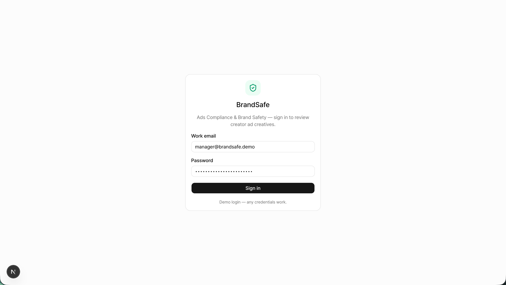
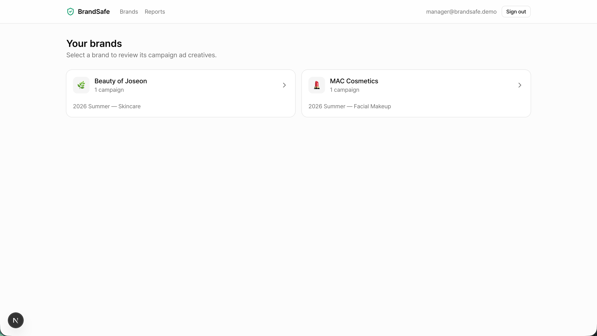
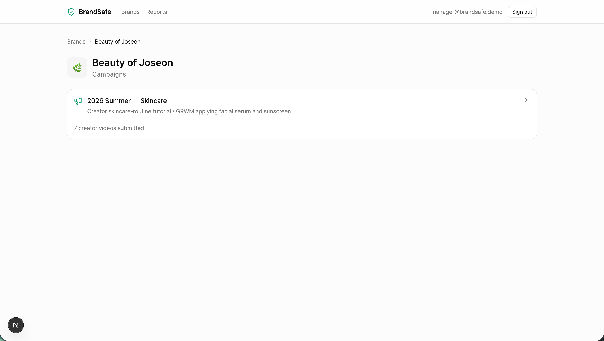
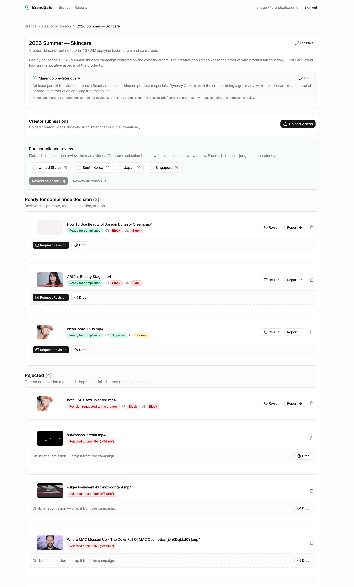
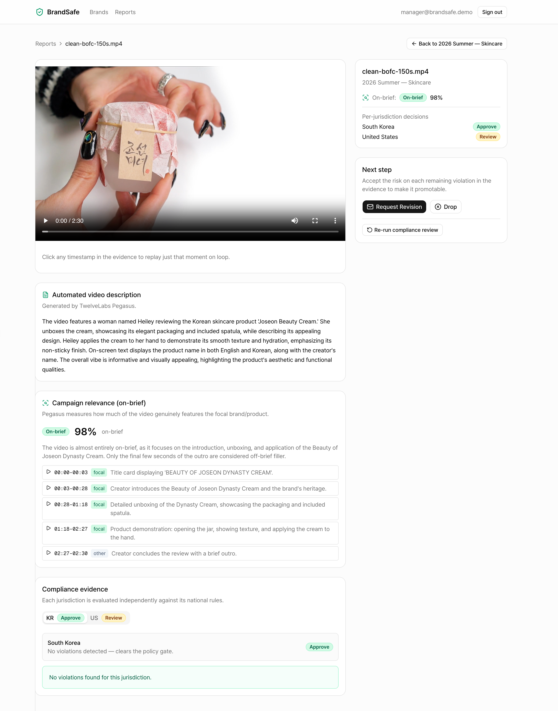
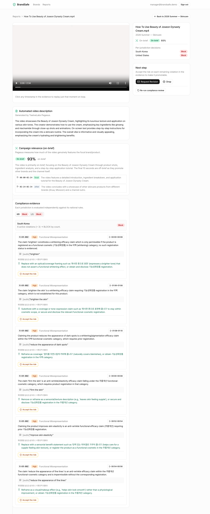
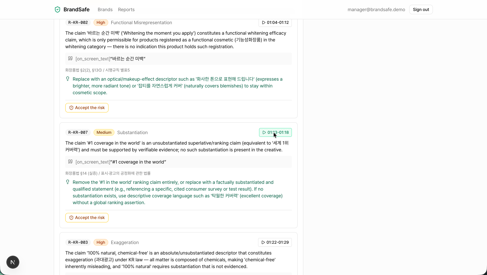
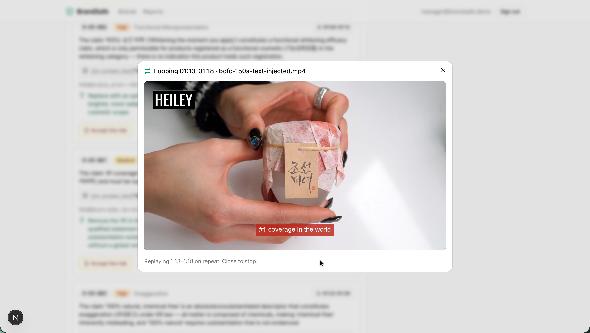
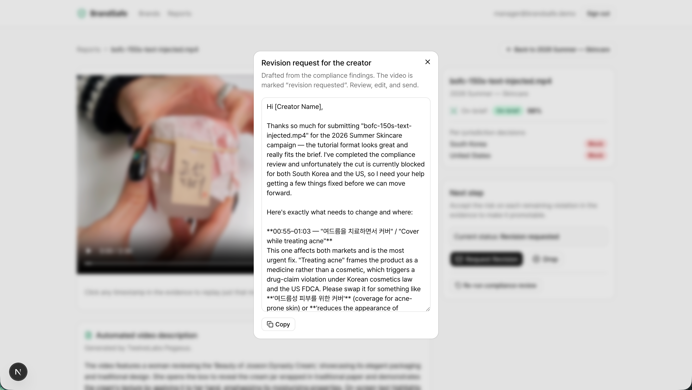
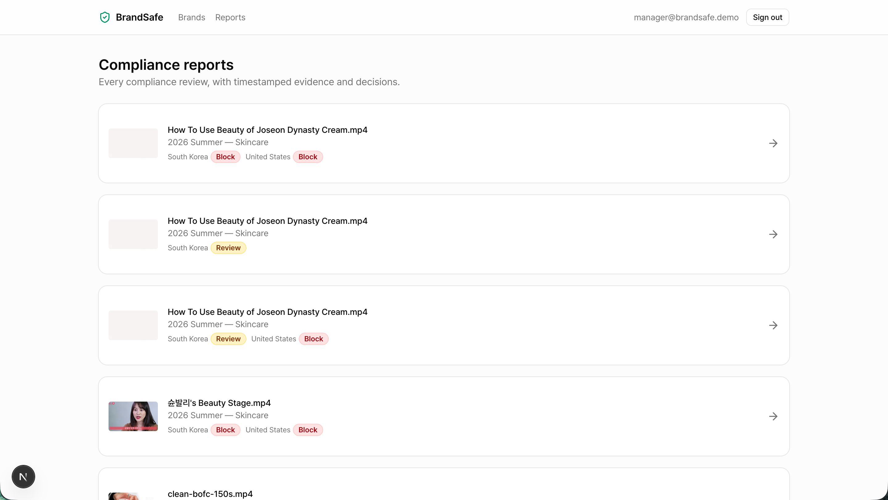

# BrandSafe — Ad Compliance & Brand Safety for Social Video Ads

A working demo for the TwelveLabs model utilization. Creator/influencer beauty
videos are the ad creative; BrandSafe reviews each one **before** it can run as a paid ad —
filtering off-brief submissions, judging makeup-ad compliance across national rules, generating
an automated description, and producing **explainable, timestamped evidence** behind an
`APPROVE` / `REVIEW` / `BLOCK` decision.

## Walkthrough

| | |
|---|---|
| **Sign in** — mock auth, any credentials work. | **Pick a brand** — each brand owns its own TwelveLabs index. |
|  |  |
| **Pick a campaign** — the brief defines what "on-brief" means. | **Campaign workspace** — upload, pick jurisdictions, and triage submissions into *ready for decision* vs *rejected* with per-market verdicts. |
|  |  |

**A clean creative** — 98% on-brief, **KR Approve / US Review**, with an auto-generated description and timestamped focal/other ranges. No violations clears the policy gate.



**A blocked creative** — 93% on-brief but **KR / US Block**: six high-severity functional-misrepresentation findings, each citing the exact Korean statute and offering a compliant rewrite.



| | |
|---|---|
| **Grounded evidence** — every finding carries a rule id, severity, category, the verbatim matched text, the national statute, a suggested fix, and a clickable timecode. | **Click a timecode** — replays just that moment on loop, so a reviewer can verify the on-screen claim (`#1 coverage in the world`) by eye. |
|  |  |
| **Request Revision** — an editable email to the creator, drafted from the findings with exact timecodes and concrete fixes. | **Compliance reports** — every review, with per-jurisdiction decisions and timestamped evidence. |
|  |  |

## The pipeline (three layers + a deterministic gate)

```
Upload ─► TwelveLabs index (per brand: Marengo 3.0 only)
            │
   ① PRE-FILTER (on upload)  Marengo embeddings — coarse anti-abuse gate
            │   top-10% clip-mean cosine vs the campaign query ≥ 0.115 → PASS, else REJECT
            │   NOT the relevance verdict — screens out junk AND same-category off-brand creatives
            ▼  (PASS → ready for compliance)
   ── compliance review (per video) ──
            │
   ② ON-BRIEF   Pegasus — the real relevance verdict
            │   on-brief % + focal-vs-other time ranges + rationale (timestamped)
            │   on_brief ≥60 · partially 35–60 · off_brief <35
            ├─ PERCEPTION  Pegasus observation JSON: WHAT IS PRESENT only
            │   (claims, content flags, endorsement, disclosure) — never a verdict
            ▼
   ③ JUDGMENT   Anthropic Sonnet + the country's OKF rule bundle
            │   maps observations→signals→rules → per-rule verdicts with citation
            ▼
   ④ DECISION   deterministic code, per jurisdiction (see below)
            ▼
   Report: description · on-brief % + ranges · per-jurisdiction decisions · timestamped evidence
   Actions: Promote to Paid Ad · Request Revision (drafted) · Drop
```

A **re-run** reuses the stored Pegasus outputs and re-runs only judgment + decision (the video
hasn't changed), so it's fast and cheap; you pick the jurisdictions per re-run.

**Two-stage relevance.** Marengo 3.0 (the model available here) returns no search
score/confidence and its search tiles the whole video, so it can't produce a trustworthy
brand-specific on-brief %. So Marengo embeddings are used only as a **coarse pre-filter at
upload** (anti-abuse: reject submissions with *no* resemblance to the campaign), and the **real
on-brief verdict is a content-aware Pegasus call at compliance time** that distinguishes the
focal brand's product from other products and returns timestamped focal/other ranges.

### Why this is trustworthy
- **Perception and judgment are separated.** Pegasus never sees a country or the word
  "violation" — it only reports observations (from `references/OKF/detection-observation-spec.md`).
  The same observation pass is replayed against each market's rules, so the evidence is consistent
  and the legal reasoning is auditable.
- **Every verdict is grounded.** Each finding cites the exact rule id + national statute, quotes
  the verbatim matched text, and carries a timecode the reviewer can click to verify by eye.
- **The gate is deterministic.** The final decision is plain code, not an LLM — reproducible and
  easy to explain to advertisers.

### How decisions are made (per jurisdiction)
`0 violations → APPROVE` · any `critical` violation → `BLOCK` (severity floor) · otherwise
`1–3 → REVIEW`, `>3 → BLOCK`. Jurisdictions are judged **independently** (US / KR / JP / SG); the
report shows one decision per market. *Promote to Paid Ad* unlocks only when every reviewed
jurisdiction is `APPROVE`.

### Compliance taxonomy (Google OKF, `references/OKF/`)
Drug/disease claims, functional-claim misrepresentation, exaggeration, unsafe/misleading usage,
medical/expert endorsement, substantiation/superlatives, disparagement, plus the shared decency
layer (sexual/suggestive, vulgar, hate, violence, unsafe behavior) and off-topic — comfortably
beyond the 5 required policy categories, across four markets.

> **Demo toggle:** the `disclosure` category (ad-label / influencer-disclosure / stealth-marketing)
> is currently **suppressed across all four markets** via `SUPPRESSED_VERDICT_CATEGORIES` /
> `SUPPRESSED_VERDICT_RULE_IDS` in `src/lib/config.ts`. Verdicts are dropped both when judged and on
> read (with the decision recomputed), so existing reports stay consistent. Empty those lists to
> restore full enforcement.

## Running it

```bash
cp .env.example .env     # then add your keys:
#   TWELVELABS_API_KEY=...
#   ANTHROPIC_API_KEY=...
npm install
npm run dev              # http://localhost:3000
```

Sign in (any credentials — mock auth) → pick **Beauty of Joseon** → **2026 Summer — Skincare** →
upload sample videos → watch the on-brief check resolve → run a compliance
review (pick the jurisdictions — none are pre-selected) → open the report and click any timecode to
replay just that moment on loop. Every list thumbnail is also a play button (incl. rejected videos),
and per-video **Re-run** opens its own jurisdiction picker and re-judges without re-running Pegasus.

### Sample video Examples (not included in the public repo. Illustrating the sampling methodology)
- `clean-bofc-150s.mp4` — on-brief, expected **APPROVE** (0 violations).
- `relevance-bofc-130-510.mp4` — relevance-band probe (partial product presence).
- `TC-M3-triple.mp4` — expected **REVIEW** (≈3 violations).
- `TC-M6-sextuple.mp4` — expected **BLOCK** (>3 violations / a critical claim).
- `sulwhasoo-cream.mp4` — a real but **competitor** cream; expected **pre-filter REJECTED** (signal 0.105
  < 0.115 bar) — demonstrates screening same-category off-brand creatives, not just off-topic junk.

## Tech
Next.js (App Router) · TypeScript · Tailwind + shadcn/ui · TwelveLabs (`twelvelabs-js`,
Marengo 3.0 + Pegasus 1.5) · Anthropic (`@anthropic-ai/sdk`, Sonnet) · better-sqlite3.

- One TwelveLabs **index per brand**, created lazily on first upload; campaigns share it and each
  video is tagged with `campaign_id` + `submission_id` in user-metadata, so a brand can later
  search across all of its campaigns. Relevance search stays scoped to the single submission.
- All heavy work is **non-blocking**: uploads kick off background jobs (`src/lib/jobs.ts`,
  `src/lib/pipeline.ts`); the UI polls for status. The index enables **Marengo 3.0 only** (clip
  embeddings for the pre-filter); **Pegasus 1.5** runs via analyze-by-`asset_id`, independent of the
  index.

### How this scales in a real ads system
The in-process job runner stands in for a real queue. In production: replace it with a durable
queue (e.g. SQS), and run Pegasus calls through **workers that respect TwelveLabs' rate
limits** (pacing requests and backing off on 429s) — since a single-process concurrency cap
doesn't hold once you scale to multiple instances. Keep the per-brand index (campaign_id in
user-metadata enables cross-campaign search), fan out perception + per-market judgment as workers,
and cache the single observation pass per video across markets so an added market re-judges
without re-running Pegasus, and persist verdicts to a warehouse. The layer boundaries (perception →
judgment → deterministic gate) and the OKF rule format stay the same — only the runtime substrate
changes.

## Layout
```
src/lib/        config, db (sqlite + seed), okf loader, twelvelabs, anthropic,
                relevance, decision (the gate), pipeline (orchestration), jobs
src/app/(app)/  brands → campaigns → campaign workspace → reports → report (player + evidence)
src/app/api/    auth, upload/delete, status, compliance, reports, actions
references/OKF/ national rule bundles + the Pegasus observation spec
```
